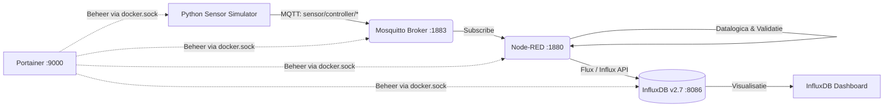

# Smart Sensor Gateway met Monitoring en Automatisatie

Dit project implementeert een containergebaseerde IoT Gateway-architectuur die industriële sensordata verzamelt via MQTT, verwerkt en valideert in Node-RED, opslaat in een tijdreeksdatabase (InfluxDB) en visualiseert op een live dashboard. De volledige stack wordt georkestreerd met Docker Compose en beheerd via Portainer.

---

## 🏗️ Systeemarchitectuur & Datastroom

Het systeem bestaat uit 5 gekoppelde Docker microservices binnen het geïsoleerde bridge-netwerk `sensor-net`:



1. **Mosquitto (MQTT Broker)**: Ontvangt en distribueert berichten over topics (`sensor/controller/joystick1`, `sensor/controller/joystick2`, `sensor/controller/buttons`).
2. **Controller Simulator (Python App)**: Simuleert joystickposities ($X, Y \in [0, 255]$) en controller-knoppen (A, B, X, Y, L1, R1, L2, R2).
3. **Node-RED**: Leest MQTT-data in, filtert ongeldige metingen via een zelfgeschreven Function node en stuurt uitsluitend gevalideerde meetpunten door naar InfluxDB.
4. **InfluxDB 2.7**: Tijdreeksdatabase waarin metingen met timestamps en tags worden opgeslagen.
5. **Portainer CE**: Beheerinterface voor realtime inzicht in de containerstatus, logging en netwerkactiviteit.

---

## ⚙️ Technische Vereisten & Implementatie

### 1. Sensorcommunicatie (MQTT)
* Broker draait op poort `1883` met anonymous access geconfigureerd in `mosquitto/config/mosquitto.conf`.
* 3 actieve topics:
  * `sensor/controller/joystick1`: `{"x": x1, "y": y1}`
  * `sensor/controller/joystick2`: `{"x": x2, "y": y2}`
  * `sensor/controller/buttons`: `"A"`, `"B"`, `"X"`, `"Y"`, `"L1"`, `"R1"`, `"L2"`, `"R2"`

### 2. Dataverwerking & Validatie (Node-RED)
In Node-RED draait een op maat gemaakte Function node (`Validatie & Datalogica`) die:
* Controleert of $X$ en $Y$ numeriek zijn en binnen het fysieke bereik vallen ($0 \le X, Y \le 255$). Foutieve of corrupte metingen worden gedropt.
* Knoppen mapt naar zowel een numeriek ID (`button_id`: 0 t/m 7) als een naam (`button_name`).
* `UNKNOWN` knopstatussen filtert en negeert.

### 3. Opslag & Dashboarding (InfluxDB)
Het InfluxDB dashboard bevat:
* **Live Joystick 1 & Joystick 2 (Line Graphs)**: Realtime weergave van X- en Y-assen.
* **Laatste Knop (Single Stat)**: Directe weergave van de meest recent ingedrukte controllerknop.
* **Gemiddelde Joystick 1 & 2 (1 uur)**: Gemiddelde uitslag over het afgelopen uur (`range(start: -1h) |> mean()`).
* **Gemiddelde Joystick 1 & 2 (24 uur)**: Gemiddelde uitslag over 24 uur (`range(start: -24h) |> mean()`).

---

## 🚀 Snelle Start / Installatie

### Vereisten
* Docker & Docker Compose geïnstalleerd.

### Opstarten
Voer in de hoofdmap het volgende commando uit:

```bash
docker compose up -d --build
```
*Of via het geautomatiseerde CI/CD script:*
* **Windows**: `.\deploy.bat`
* **Linux**: `./deploy.sh`
* **Makefile**: `make deploy`

---

## 🌐 Toegang tot Services & Credentials

| Service | URL | Gebruikersnaam | Wachtwoord / Token |
| :--- | :--- | :--- | :--- |
| **Node-RED** | [http://localhost:1880](http://localhost:1880) | - | - |
| **InfluxDB** | [http://localhost:8086](http://localhost:8086) | `admin` | `Admin123`  |
| **Portainer** | [http://localhost:9000](http://localhost:9000) | `admin` | *(In te stellen bij eerste opstart)* |
| **Mosquitto** | `localhost:1883` | - | - |

---

## 📊 Dashboard Importeren in InfluxDB (bij nieuwe clone)

Omdat databasebestanden worden uitgesloten in `.gitignore`, importeer je het dashboard na een verse clone in 2 klikken:
1. Surf naar [http://localhost:8086](http://localhost:8086) ➔ **Dashboards**.
2. Klik op **Create Dashboard** (dropdown) ➔ **Import Dashboard**.
3. Upload het bestand [influxdb_setup/dashboard.json](influxdb_setup/dashboard.json) of plak de inhoud.

---

## 🔄 Continuous Integration & Deployment (CI/CD)

Het project bevat een geautomatiseerde deployment-procedure ([deploy.bat](deploy.bat) / [deploy.sh](deploy.sh) / [makefile](makefile)):

```bash
# 1. Haal laatste wijzigingen op
git pull origin main

# 2. Herbouw gewijzigde containers zonder cache
docker compose build --no-cache

# 3. Herstart containers met minimale downtime
docker compose up -d --remove-orphans

# 4. Ruim ongebruikte dangling images op
docker image prune -f
```

### Toelichting CI/CD in productie:
In een productieomgeving (zoals GitHub Actions of GitLab CI) wordt dit script automatisch getriggerd bij een `push` naar de `main` branch. De runner logt via SSH in op de edge-gateway en voert het deployment-script uit, waardoor code-wijzigingen direct en zonder menselijke tussenkomst live gaan.

---

## 👥 Reflectie & Samenwerking

* **Senne Herman**: Opzetten van Docker Compose stack, netwerkconfiguratie, Mosquitto MQTT broker, Python controller simulator, Node-RED datalogica/validatie, InfluxDB time-series dashboard en CI/CD automatiseringsscripts.
