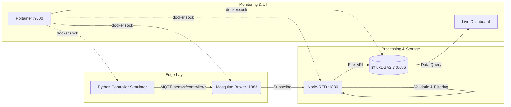

# Smart Sensor Gateway met Monitoring en Automatisatie

**VIVES Hogeschool — Bachelor Elektronica-ICT**  
**Vak**: Cloud Computing  
**Auteur**: Senne Herman  

---

## 📋 Overzicht van het Project

Dit project implementeert een containergebaseerde **Edge IoT Gateway-architectuur**. Het systeem leest continu industriële sensordata (joysticks en controllerknoppen) uit via MQTT, verwerkt en valideert de datastroom in Node-RED, slaat de tijdreeksmetingen op in InfluxDB en visualiseert deze in een live dashboard. Het volledige ecosysteem wordt georkestreerd met Docker Compose en beheerd via Portainer.

---

## 🏗️ Systeemarchitectuur & Datastroom

Alle services communiceren via het geïsoleerde Docker bridge-netwerk `sensor-net`:



### Microservices:
1. **Mosquitto (`eclipse-mosquitto:2`)**: Centrale MQTT message broker die inkomende sensorberichten ontvangt en distribueert.
2. **Controller Simulator (Python 3.12)**: Simuleert een controller met 2 joysticks ($X, Y \in [0, 255]$) en knoppen (A, B, X, Y, L1, R1, L2, R2) en publiceert elke 5 seconden.
3. **Node-RED**: Ingest data via MQTT, voert datavalidatie en filtering uit in een zelfgeschreven Function Node en stuurt gevalideerde data door naar InfluxDB.
4. **InfluxDB 2.7**: Tijdreeksdatabase die metingen bewaart met timestamps en metadata.
5. **Portainer CE**: Beheerinterface voor realtime inzicht in containerstatussen, logging en resources.

---

## 🚀 Volledig Geautomatiseerde Installatie (Zero-Config)

Het project is **100% plug-and-play**. Na het clonen start de hele keten automatisch op inclusief pre-installed plugins, tokens en dashboard:

### 1. Repository clonen & starten
```bash
git clone https://github.com/Sennehrm/herkansing-cloud.git
cd herkansing-cloud
docker compose up -d --build
```

*Of via de CI/CD deployment scripts:*
* **Windows**: `.\deploy.bat`
* **Linux**: `./deploy.sh`
* **Makefile**: `make deploy`

---

## ⚙️ Technische Specificaties & Implementatie

### 1. Sensorcommunicatie (MQTT)
De simulator publiceert naar drie afzonderlijke topics:
* `sensor/controller/joystick1` ➔ `{"x": x1, "y": y1}`
* `sensor/controller/joystick2` ➔ `{"x": x2, "y": y2}`
* `sensor/controller/buttons` ➔ `"A"`, `"B"`, `"X"`, `"Y"`, `"L1"`, `"R1"`, `"L2"`, `"R2"`

### 2. Dataverwerking & Validatielogica (Node-RED)
In Node-RED draait de zelfgeschreven **Function Node** (`Validatie & Datalogica`):
* **Bereikvalidatie**: Controleert of $0 \le X, Y \le 255$. Foutieve of ontbrekende meetwaarden worden onmiddellijk gedropt (niet naar de databank geschreven).
* **Button Mapping**: Vertaalt de knoptekst naar een numeriek ID (0 t/m 7) en bewaart de naam als label.
* **Filtering**: Negeert ongeldige of `UNKNOWN` knoppen.
* **Auto-Provisioning**: De Node-RED container bouwt via `nodered/Dockerfile` automatisch de `node-red-contrib-influxdb` plugin in en laadt de flows en credentials zonder handmatige stappen.

### 3. Opslag & Dashboarding (InfluxDB)
InfluxDB wordt bij de allereerste start automatisch geconfigureerd via `/docker-entrypoint-initdb.d/setup.sh` en laadt direct het dashboard in met:
* 🎮 **Joystick 1 Live (X & Y)**: Realtime lijngrafiek van Joystick 1 uitslagen.
* 🕹️ **Joystick 2 Live (X & Y)**: Realtime lijngrafiek van Joystick 2 uitslagen.
* 🔘 **Laatste Knop**: Toont live de laatst ingedrukte controllerknop.
* ⏱️ **Gemiddelde Joystick 1 & 2 (1 uur)**: Berekent het gemiddelde over het afgelopen 1 uur (`start: -1h`).
* 📅 **Gemiddelde Joystick 1 & 2 (24 uur)**: Berekent het gemiddelde over 24 uur (`start: -24h`).

---

## 🌐 Toegang tot Services & Credentials

| Service | URL | Gebruikersnaam | Wachtwoord / Token |
| :--- | :--- | :--- | :--- |
| **InfluxDB Dashboard** | [http://localhost:8086](http://localhost:8086) | `admin` | `Admin123` / Token: `my-influx-token` |
| **Node-RED Flows** | [http://localhost:1880](http://localhost:1880) | - | *(Pre-geconfigureerd met token)* |
| **Portainer UI** | [http://localhost:9000](http://localhost:9000) | `admin` | *(In te stellen bij 1e opstart)* |
| **Mosquitto MQTT** | `localhost:1883` | - | *(Anonieme toegang toegestaan)* |

---

## 🔄 CI/CD & Deployment Pipeline

Het project bevat geautomatiseerde deployment-scripts ([deploy.bat](deploy.bat), [deploy.sh](deploy.sh) en [makefile](makefile)) die het volledige CI/CD-principe demonstreren:

1. **`git pull origin main`**: Haalt de nieuwste broncode binnen vanaf de Git repository.
2. **`docker compose build --no-cache`**: Herbouwt de gewijzigde applicatie-images schoon zonder oude build-cache.
3. **`docker compose up -d --remove-orphans`**: Rold de nieuwe containers uit met minimale downtime.
4. **`docker image prune -f`**: Verwijdert ongebruikte 'dangling' images om schijfruimte vrij te houden.
5. **Health Check (`docker compose ps`)**: Valideert dat alle services actief en gezond draaien.

### CI/CD in Productie
In een professionele productieomgeving wordt deze flow getriggerd via een GitHub Actions workflow (`.github/workflows/deploy.yml`). Bij elke `git push` naar de `main` branch bouwt de runner de images, test de containers en rolt deze via SSH automatisch uit naar de live edge server.

---

## 👥 Reflectie & Samenwerking

* **Senne Herman**: 
  * Ontwerp en opzet van de Docker Compose gateway-architectuur en netwerkisolatie.
  * Configuratie van Mosquitto MQTT broker en implementatie van de Python controller simulator.
  * Ontwikkeling van de datavalidatie en filterlogica in Node-RED.
  * Configuratie van InfluxDB tijdreeksdata, Flux aggregatiequeries en live dashboard visualisaties.
  * Bouw van de geautomatiseerde CI/CD deployment scripts en technische documentatie.
